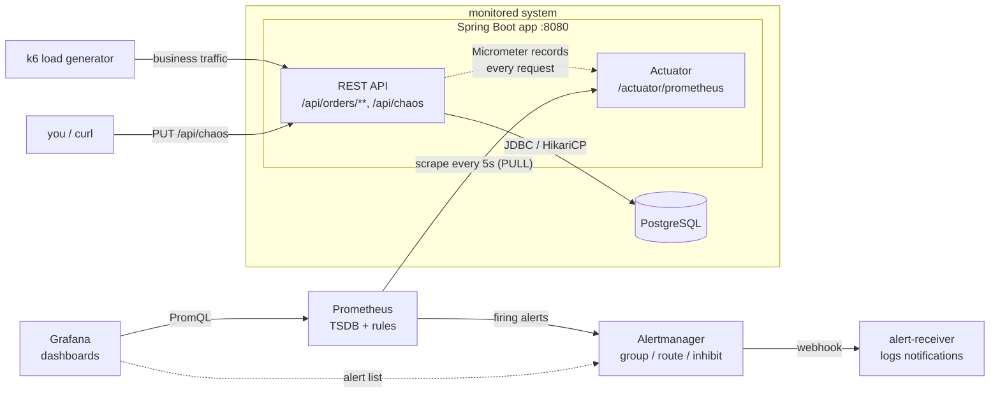

# Monitoring Demo: Spring Boot + Prometheus + Grafana

A minimal but realistic stack that shows the **core concepts of Prometheus and Grafana** on a
real Spring Boot 4 service backed by PostgreSQL. Traffic comes from **k6**, alerts go through
**Alertmanager**, and **fault injection** (chaos) lets you break things on purpose and watch
dashboards and alerts react.

> **Purpose:** learn and demonstrate *metrics-based monitoring* end to end:
> instrument → scrape → store → query → visualize → alert → route the notification.

---

## Contents

1. [Architecture](#1-architecture)
2. [Quick start](#2-quick-start)
   - [Prerequisites](#prerequisites)
   - [Start the stack](#start-the-stack)
   - [Open the UIs](#open-the-uis)
   - [Generate traffic (k6)](#generate-traffic-k6)
   - [Inject faults (chaos)](#inject-faults-chaos)
   - [Watch alert notifications](#watch-alert-notifications)
   - [Stop / clean up](#stop--clean-up)
   - [Reload configuration without restarting](#reload-configuration-without-restarting)
   - [Validate configuration before reloading](#validate-configuration-before-reloading)
3. [Theoretical Background - Prometheus](#3-theoretical-background---prometheus)
   - [3.1 Why metrics, and the pull model](#31-why-metrics-and-the-pull-model)
   - [3.2 Prometheus data model](#32-prometheus-data-model)
   - [3.3 Scraping: jobs, instances and `up`](#33-scraping-jobs-instances-and-up)
   - [3.4 PromQL essentials](#34-promql-essentials)
   - [3.5 The four metric types](#35-the-four-metric-types)
   - [3.6 Sample values: what is actually stored](#36-sample-values-what-is-actually-stored)
   - [3.7 Prometheus rules](#37-prometheus-rules)
     - [Recording rules](#recording-rules)
     - [Alerting rules and Alertmanager](#alerting-rules-and-alertmanager)
   - [3.8 Cardinality (costs): the #1 production pitfall](#38-cardinality-costs-the-1-production-pitfall)
   - [3.9 What to measure: RED, USE, Four Golden Signals](#39-what-to-measure-red-use-four-golden-signals)
   - [3.10 In-Code Definition: Spring Boot, Actuator and Micrometer](#310-in-code-definition-spring-boot-actuator-and-micrometer)
4. [Project structure](#4-project-structure)
   - [REST API](#rest-api)
5. [Metrics catalog](#5-metrics-catalog)
6. [Using the Grafana dashboards](#6-using-the-grafana-dashboards)
   - [6.1 Grafana concepts](#61-grafana-concepts)
   - [6.2 Finding your way around](#62-finding-your-way-around)
   - [6.3 Orders Service - RED & Business: panel guide](#63-orders-service---red--business-panel-guide)
   - [6.4 JVM & Database - USE: panel guide](#64-jvm--database---use-panel-guide)
   - [6.5 How to investigate: a reading workflow](#65-how-to-investigate-a-reading-workflow)
7. [Demo scenarios: what to do and what to watch](#7-demo-scenarios-what-to-do-and-what-to-watch)
   - [Chaos engineering: what the scenarios are](#chaos-engineering-what-the-scenarios-are)
   - [Startup](#startup)
   - [Scenario 1: Baseline (healthy system)](#scenario-1-baseline-healthy-system)
   - [Scenario 2: Errors → `HighErrorRate`](#scenario-2-errors--higherrorrate)
   - [Scenario 3: Latency → `HighLatencyP95`](#scenario-3-latency--highlatencyp95)
   - [Scenario 4: Saturation of the queue → `OrderQueueBacklog`](#scenario-4-saturation-of-the-queue--orderqueuebacklog)
   - [Scenario 5: DB connection pool exhaustion → `DbConnectionPoolExhausted`](#scenario-5-db-connection-pool-exhaustion--dbconnectionpoolexhausted)
   - [Scenario 6: Instance down → `InstanceDown`, routing and inhibition](#scenario-6-instance-down--instancedown-routing-and-inhibition)
   - [Scenario 7: Silence an alert](#scenario-7-silence-an-alert)
   - [Scenario 8: Explore and PromQL by hand](#scenario-8-explore-and-promql-by-hand)
8. [Concepts: covered and not covered](#8-concepts-covered-and-not-covered)
   - [Prometheus concepts](#prometheus-concepts)
   - [Alertmanager concepts](#alertmanager-concepts)
   - [Grafana concepts](#grafana-concepts)
   - [Spring Boot / Micrometer and load-testing concepts](#spring-boot--micrometer-and-load-testing-concepts)
9. [Limitations and gaps](#9-limitations-and-gaps)
10. [Troubleshooting](#10-troubleshooting)
11. [Further reading](#11-further-reading)

---

## 1. Architecture



The app serves two kinds of traffic on the same port.\
**Clients** (k6, curl) call only the business API under `/api/**`.\
**Prometheus** only scrapes (fetches) `/actuator/prometheus` metrics endpoint (provided by Spring Boot and Micrometer).

**Recording:**\
The backend API never directly calls any actuator endpoint.\
**Micrometer** (as part of app / Maven dependency) records each API request in memory (via `Counter`, `Gauge`, `Timer`, `DistributionSummary` classes; like SLF4J for logging).\
It exports (Prometheus-compatible format) them through a registry to the backend API, and Prometheus's scrape (fetch) reads those values.\
Alongside the provided Spring Boot + Micrometer metrics, Prometheus also provides custom additional recording rules (`prometheus/rules/recording.yml`), evaluated on interval.\
**Grafana** only reads.

**Alerting:**\
Runs entirely on the Prometheus side, from the stored time series (Prometheus's TSDB).\
Prometheus evaluates the alerting rules (`prometheus/rules/alerts.yml`) and pushes firing alerts to **Alertmanager**; it never sends notifications itself.\
**Grafana** doesn't fetch alerts from Alertmanager; they read them from Prometheus. Only Grafana's Alerting pages query Alertmanager.\
**alert-receiver** demonstrates a separate consumer (in real life it is Slack, PagerDuty, e-mail, ...), provided as Alertmanager webhook.

| Component | Version | URL | What it does here |
|---|---|---|---|
| **app** | Spring Boot 4.1.1, Java 21 | <http://localhost:8080> | Order REST API, exposes metrics at [`/actuator/prometheus`](http://localhost:8080/actuator/prometheus) |
| **postgres** | 17 | `localhost:5432` (demo/demo) | Real database, so HikariCP pool metrics are meaningful |
| **prometheus** | 3.15 | <http://localhost:9090> | Scrapes (fetches) metrics, stores time series, evaluates recording and alerting rules |
| **alertmanager** | 0.34 | <http://localhost:9093> | Groups, routes, inhibits and silences alerts, then sends notifications |
| **alert-receiver** | http-https-echo | <http://localhost:8085> | Stand-in for Slack/PagerDuty: logs every webhook it receives |
| **grafana** | 13.2 | <http://localhost:3000> (admin/admin) | Dashboards, provisioned from files |
| **k6** | 2.3 | n/a | Generates realistic traffic (run on demand) |

---

## 2. Quick start

### Prerequisites

- Docker Desktop (Compose v2). That's all you need: the app is built inside Docker.
- Optional for local development: JDK 21 + Maven 3.9.

### Start the stack

```bash
docker compose up -d --build
```

The first build downloads Maven dependencies and takes a few minutes. Then check:

| Check | Where |
|---|---|
| App is healthy | <http://localhost:8080/actuator/health> |
| Raw metrics, exactly as Prometheus sees them | <http://localhost:8080/actuator/prometheus> |
| All targets `UP` | <http://localhost:9090/targets> |
| Rules loaded | <http://localhost:9090/rules> |
| Dashboards | <http://localhost:3000> → *Dashboards → Monitoring Demo* |

### Open the UIs

All UIs run in Docker and are published on `localhost`. Open them in a browser:

| UI | URL | Login | Most useful pages |
|---|---|---|---|
| **Grafana** | <http://localhost:3000> | `admin` / `admin` (skip the password change prompt) | *Dashboards → Monitoring Demo* (the two dashboards), *Explore* (ad hoc PromQL), *Alerting → Silences* |
| **Prometheus** | <http://localhost:9090> | none | [Query](http://localhost:9090/query) (run PromQL, *Table* / *Graph* tabs), [Targets](http://localhost:9090/targets) (scrape status), [Alerts](http://localhost:9090/alerts) (inactive / pending / firing), [Rules](http://localhost:9090/rules), [TSDB status](http://localhost:9090/tsdb-status) (cardinality) |
| **Alertmanager** | <http://localhost:9093> | none | Alerts grouped by `alertname` + `job`, *Silences → New silence* |
| **App metrics (raw)** | <http://localhost:8080/actuator/prometheus> | none | The plain-text page Prometheus scrapes (fetches) |
| **Alert receiver** | no UI | n/a | `docker compose logs -f alert-receiver` |

Ports and logins are set in [`docker-compose.yml`](docker-compose.yml).

> [!WARNING]
> **For local use only.** Grafana uses `admin/admin`, and Prometheus, Alertmanager and the actuator endpoints have no
> authentication or TLS. All ports are published, so don't run this stack on a machine reachable from other networks.

### Generate traffic (k6)

```bash
# default "load" profile: ramps to 20 iterations/s, ~8 minutes
docker compose run --rm k6 run /scripts/load.js

# "spike" profile: 60 iterations/s, overloads the shipping worker (~6 minutes)
docker compose run --rm k6 run -e PROFILE=spike /scripts/load.js

# "smoke" profile: 1 minute sanity check
docker compose run --rm k6 run -e PROFILE=smoke /scripts/load.js
```

> [!NOTE]
> On Git Bash for Windows, prefix with `MSYS_NO_PATHCONV=1` so `/scripts/load.js` isn't rewritten to a Windows path.

**Traffic mix:** 50% create order, 25% get order by id (some 404s), 15% list, 7% stats, 3% invalid requests (400/404).

### Inject faults (chaos)

What chaos is and how the scenarios use it: [Chaos engineering](#chaos-engineering-what-the-scenarios-are).

```bash
# 20% of order requests fail with HTTP 500
curl -X PUT localhost:8080/api/chaos -H "Content-Type: application/json" \
     -d '{"errorRate":0.2,"latencyMs":0,"dbLatencyMs":0}'

# +600 ms on every order request
curl -X PUT localhost:8080/api/chaos -H "Content-Type: application/json" \
     -d '{"errorRate":0,"latencyMs":600,"dbLatencyMs":0}'

# the stats query holds a DB connection for 1.5 s -> exhausts the 5-connection pool
curl -X PUT localhost:8080/api/chaos -H "Content-Type: application/json" \
     -d '{"errorRate":0,"latencyMs":0,"dbLatencyMs":1500}'

curl localhost:8080/api/chaos              # show current settings
curl -X DELETE localhost:8080/api/chaos    # back to normal
```

PowerShell equivalent:

```powershell
Invoke-RestMethod -Method Put -Uri http://localhost:8080/api/chaos -ContentType 'application/json' `
  -Body '{"errorRate":0.2,"latencyMs":0,"dbLatencyMs":0}'
Invoke-RestMethod -Method Delete -Uri http://localhost:8080/api/chaos
```

> [!IMPORTANT]
> Every `PUT` must contain **all three fields** (`errorRate`, `latencyMs`, `dbLatencyMs`). A request with a field
> missing is rejected with **HTTP 400** and the previous settings stay active. Set the faults you don't want to `0`.

### Watch alert notifications

```bash
# alert-receiver is a small echo web server, to demonstrate a separate alert consumer.
# Alertmanager is configured to send its webhooks to it, and alert-receiver writes everything it receives to its log.
# "docker compose logs alert-receiver" prints that container's log.
# -f (follow) keeps the command running and streams new lines as they arrive.
docker compose logs -f alert-receiver
```

### Stop / clean up

```bash
# Stops and removes all six containers of this project (postgres, app, prometheus, alertmanager,
# alert-receiver, grafana) plus the project network.
# k6 isn't included: "docker compose run --rm k6" deletes its container as soon as the test ends.
# "docker compose ps -a" (run in the project folder) lists what belongs to the project.
docker compose down        # stop, keep data (Postgres, Prometheus TSDB, Grafana)
docker compose down -v     # stop and delete all data volumes
```

> [!WARNING]
> `docker compose down -v` **permanently deletes all data**: Postgres orders, the Prometheus history and Grafana settings.
> Use plain `docker compose down` to stop the stack and keep them.

### Reload configuration without restarting

```bash
# Use when you edit a config file while the stack is running.
curl -X POST localhost:9090/-/reload   # Prometheus (enabled by --web.enable-lifecycle)
curl -X POST localhost:9093/-/reload   # Alertmanager
```

Grafana re-reads the dashboard JSON files every 30 seconds.

### Validate configuration before reloading

`promtool` and `amtool` ship inside the official images:

```bash
# Safety check to run after editing a config file and before reloading it.
# Git Bash: prefix with MSYS_NO_PATHCONV=1
docker compose exec prometheus promtool check config /etc/prometheus/prometheus.yml
docker compose exec alertmanager amtool check-config /etc/alertmanager/alertmanager.yml
```

---

## 3. Theoretical Background - Prometheus

### 3.1 Why metrics, and the pull model

Observability usually rests on three signals: **metrics** (numbers over time), **logs** (events)
and **traces** (request paths across services). Metrics are the cheapest to store and the fastest
to query, so they drive **dashboards and alerts**. This project covers metrics only.

Prometheus uses a **pull model**: the application only *exposes* its current values over HTTP,
and Prometheus *scrapes* (fetches) them on a fixed interval.

| Pull (Prometheus) | Push (StatsD, OTLP push, ...) |
|---|---|
| The app doesn't need to know where monitoring lives | The app must know the collector address |
| A failed scrape is itself a signal (`up == 0`) | A silent app looks the same as a healthy idle one |
| Easy to curl `/actuator/prometheus` and see the truth | Needs a gateway for short-lived jobs |
| Needs network reachability *to* the targets | Works through NAT / firewalls more easily |

For short batch jobs that end before a scrape, Prometheus offers the *Pushgateway*. That's not used here.

### 3.2 Prometheus data model

Everything is a **time series**, identified by a **metric name** plus a set of **labels**. This is how the app exposes
them at `/actuator/prometheus` (the plain-text **exposition format**; `# HELP` and `# TYPE` describe the metric):

```
# HELP orders_placed_total
# TYPE orders_placed_total counter
orders_placed_total{application="monitoring-demo",channel="web",job="monitoring-demo",instance="app:8080"}    512.0
orders_placed_total{application="monitoring-demo",channel="mobile",job="monitoring-demo",instance="app:8080"} 341.0
└── metric name ──┘└──────────────────────────────────────── labels ────────────────────────────────────────┘ value
```

> [!NOTE]
> - Each **unique combination** of name + labels is a separate series (it can contain multiple values).
> - A series stores **samples**: `(timestamp, float64 value)` pairs, one per scrape.
> - Labels are what make PromQL powerful (`sum by (status)`, `{uri="/api/orders"}`). They are also the main cost driver (see [cardinality](#38-cardinality-costs-the-1-production-pitfall)).

### 3.3 Scraping: jobs, instances and `up`

From [`prometheus/prometheus.yml`](prometheus/prometheus.yml):

```yaml
scrape_configs:
  - job_name: monitoring-demo            # -> label job="monitoring-demo"
    metrics_path: /actuator/prometheus
    scrape_interval: 5s
    static_configs:
      - targets: ["app:8080"]            # -> label instance="app:8080"
```

> [!NOTE]
> - **Target**: one endpoint to scrape. **Job**: a group of targets doing the same thing.
> - Prometheus attaches `job` and `instance` to every scraped series.
> - For every target it also writes **synthetic series**: `up` (1 = scrape OK, 0 = failed),
>   `scrape_duration_seconds` and `scrape_samples_scraped`. `up == 0` is the most basic alert of all.
> - Here targets are listed statically. In Kubernetes or the cloud, **service discovery** finds defined app metadata labels for you. The concept is the same.

### 3.4 PromQL essentials

**PromQL** (Prometheus Query Language) is the read-only query language for the time series in Prometheus.\
A query **selects** series by metric name and labels, **transforms** them with functions (`rate`, `histogram_quantile`, ...) and **aggregates** them across labels (`sum by (...)`).\
The result is a set of series: a graph, a single number, or a true/false condition.\
The same language is used everywhere: Grafana panels, the Prometheus UI, recording rules and alerting rules.\
An alert is just a PromQL expression that returns a result.

| Concept | Example | Meaning |
|---|---|---|
| Instant vector selector | `orders_queue_size` | Latest value of every matching series |
| Label matchers | `{status=~"5..", uri!~"/actuator.*"}` | `=`, `!=`, `=~` regex, `!~` negative regex |
| Range vector | `orders_placed_total[5m]` | All samples in the last 5 minutes (input for functions) |
| `rate()` | `rate(orders_placed_total[5m])` | Per-second average increase. Handles counter resets. **Use for graphs and alerts.** |
| `irate()` | `irate(x[5m])` | Uses only the last 2 samples: very spiky, for fast-moving zoomed-in graphs |
| `increase()` | `increase(orders_placed_total[1h])` | Total increase over the window (= rate × seconds) |
| Aggregation | `sum by (channel) (rate(...))` | `sum`, `avg`, `max`, `min`, `count`, `topk`. `by` keeps labels, `without` drops them |
| Binary ops | `errors / total` | Series are matched on identical label sets |
| Percentiles | `histogram_quantile(0.95, sum by (le) (rate(x_bucket[5m])))` | **Keep `le`** in the aggregation! |
| Over-time | `max_over_time(orders_queue_size[10m])` | Aggregate a gauge over time |
| Absent | `absent(up{job="monitoring-demo"})` | Alert when a series disappears entirely |

> [!TIP]
> Rules of thumb:
> - **`rate` first, then `sum`** (never `rate(sum(...))`), because counter-reset detection needs raw series.
> - The range should be at least **4× the scrape interval**. In Grafana, use `$__rate_interval`, which does this for you.

> [!IMPORTANT]
> **Missing series are not zero.** A labelled series exists only after its first increment. Before the first 5xx,
> `errors / total` returns *nothing* ("No data" in Grafana) instead of `0`. Fix it with `(errors or vector(0)) / total`, or
> `(errors or total * 0) / total` when you need to keep labels. The error panels and the recording rule here do this.

### 3.5 The four metric types

| Type | Semantics | Typical use | How to query | In this app |
|---|---|---|---|---|
| **Counter** | Only goes up (resets to 0 on restart) | Requests, errors, orders, bytes sent | **Always** wrap it: `rate()`, `increase()`. The raw value is meaningless. | `orders_placed_total`, `orders_payments_total` |
| **Gauge** | Current value, goes up and down | Queue size, memory, active connections, temperature | Use as is, or `avg_over_time()`, `max_over_time()`. **Never** `rate()`. | `orders_queue_size`, `hikaricp_connections_active` |
| **Histogram** | Counts observations into cumulative buckets `le` (≤), plus `_sum` and `_count` | Latency, payload sizes | `histogram_quantile(0.95, sum by (le) (rate(x_bucket[5m])))` | `http_server_requests_seconds`, `payment_process_seconds`, `orders_shipping_seconds` |
| **Summary** | Quantiles computed **inside the app**, plus `_sum` and `_count` | Latency when you have one instance and fixed quantiles | Read `x{quantile="0.95"}` directly | `orders_amount_euros` |

> [!IMPORTANT]
> **Never `rate()` a gauge.** A gauge goes down legitimately, and `rate()` reads every drop as a counter reset, so the
> result is nonsense. Use a gauge as is, or with `*_over_time()` functions. `rate()` and `increase()` are for counters only.

**Histogram vs Summary: the key difference.** Histogram buckets can be **summed across
instances** and any percentile can be computed later. Summary quantiles **cannot be aggregated**:
an average of p95s is *not* a p95. Prefer histograms. A summary's only advantage is precision
when there is no aggregation.

The *average* comes from either type as `rate(x_sum[5m]) / rate(x_count[5m])`. Averages hide
outliers, which is why dashboards show p50/p95/p99.

### 3.6 Sample values: what is actually stored

Almost everything here is **counting requests**: how many orders were placed, how many requests took ≤ 100 ms, how
many answered `201`. Even latency is stored as counts of requests per latency bucket. The values below are real, captured from this
stack during a k6 smoke run.

> [!NOTE]
> **Naming conventions:**
> - `snake_case`.
> - Base units in the name: `_seconds`, `_bytes`.
> - `_total` for counters.
> - `_bucket`, `_sum`, `_count` for histograms (Micrometer also adds `_max`).
> - Descriptive suffixes like `_size` come from the Micrometer meter name (`orders.queue.size` → `orders_queue_size`).

Every query below can be run in the Prometheus UI (<http://localhost:9090/query>, *Table* tab) or through the HTTP API:

```
http://localhost:9090/api/v1/query?query=...
```

The API returns JSON: each series' labels plus `[Unix timestamp, "value"]` pairs. The listings below are condensed
from that JSON (timestamps converted to clock time, labels added by Prometheus such as `job`/`instance` left out).

Sample raw response for `query=orders_placed_total[20s]` (← annotations added, shortened to two series):

```text
{
  "status": "success",
  "data": {
    "resultType": "matrix",                    ← a range vector [20s] = "matrix"
    "result": [
      {
        "metric": {
          "__name__": "orders_placed_total",
          "application": "monitoring-demo",    ← from the app (common tag)
          "channel": "mobile",                 ← from the app (your code)
          "instance": "app:8080",              ← added by Prometheus at scrape
          "job": "monitoring-demo",            ← added by Prometheus at scrape
          "team": "orders"                     ← added by prometheus.yml target labels
        },
        "values": [
          [1790928795.32,  "115"],             ← [Unix timestamp, value as string]
          [1790928800.32,  "115"],             ← +5 s = scrape interval
          [1790928805.32,  "115"],
          [1790928810.319, "115"]
        ]
      },
      { "metric": { ..., "channel": "web", ... },
        "values": [[1790928795.32, "169"], ...] }
    ]
  }
}
```

**Counter: orders placed, per channel.** The raw samples: one every 5 s (the scrape interval), never decreasing:

```
query: orders_placed_total[20s]
  {channel="web"}      10:03:35 → 153   10:03:40 → 155   10:03:45 → 159   10:03:50 → 165
  {channel="mobile"}   10:03:35 → 104   10:03:40 → 109   10:03:45 → 111   10:03:50 → 114
```

The raw value ("165 since the app started") is rarely useful. `rate(orders_placed_total[1m])` turns it into orders per
second: web 153 → 165 in 15 s ≈ 0.8/s.

**Gauge: shipping queue size.** Goes up and down; the current value is meaningful as is:

```
query: orders_queue_size[20s]
  {}   10:03:40 → 0   10:03:45 → 2   10:03:50 → 1   10:03:55 → 0
```

**Histogram: request latency, stored as cumulative counts per bucket.** `le` = "less than or equal". These are a few
of the bucket series for `POST /api/orders` → `201`:

```
query: http_server_requests_seconds_bucket{method="POST", uri="/api/orders", status="201"}
  le="0.05"   →  58      58 requests took ≤ 50 ms
  le="0.1"    → 180     180 requests took ≤ 100 ms
  le="0.3"    → 354     354 requests took ≤ 300 ms
  le="+Inf"   → 354     all requests (= _count)
```

`histogram_quantile(0.95, ...)` estimates the p95 from these counts (≈ 150 ms here). Individual request times are
never stored.

**Histogram `_count`: requests per status code.** The same request counting, turned into a per-second rate and
aggregated to one series per status:

```
query: sum by (status) (rate(http_server_requests_seconds_count{uri!~"/actuator.*"}[5m]))
  status="200" → 0.315/s    reads
  status="201" → 0.271/s    orders created
  status="400" → 0.010/s    invalid payloads (sent on purpose by k6)
  status="404" → 0.010/s    unknown product / order id
```

Dividing the `status=~"5.."` part by the total gives the error ratio.

### 3.7 Prometheus rules

**How it works** (common to both kinds of rules):

- **Who checks the rules:**\
  The **Prometheus server** itself, through its built-in rule manager, not Micrometer or the app.\
  Nothing is "listening". It's a timer:
  - Every 15 s it runs each rule against its own stored data (TSDB): the time series it has already scraped from the app.
  - It never calls the app to do this. Evaluating rules and scraping are two independent loops inside Prometheus.
- **Where the results go:**
  - **Recording rules:** the result is written back into Prometheus's own storage (TSDB) as a new time series, under
    the rule's name, for example `application:http_server_requests_errors:ratio_rate1m`. It's read by:
    - the *Error ratio* panel's second line (B) on the RED dashboard
    - the alert rules: `HighErrorRate` uses the error-ratio rule, `HighLatencyP95` uses the p95 rule
  - **Alerting rules:** these go two ways:
    - **Grafana:** the state is stored in the same TSDB as the `ALERTS` series, which feeds the dashboards' red annotation markers
    - **alert-receiver:** firing alerts are pushed to **Alertmanager**, which groups and routes them and sends them on as webhooks

> [!IMPORTANT]
> So the chain is: **app (Micrometer) → scrape → Prometheus TSDB → rules → new series in the same TSDB** (recording)
> **or → Alertmanager** (alerting).

### Recording rules

A recording rule evaluates a PromQL expression periodically and **stores the result as a new series**.\
It's used for expensive or reused expressions (dashboards, alerts, SLOs: Service Level Objectives, targets such as "99% of requests faster than 300 ms").\
The naming convention is `level:metric:operations`.\
See [`prometheus/rules/recording.yml`](prometheus/rules/recording.yml):

```yaml
- record: application:http_server_requests_errors:ratio_rate1m
  expr: |
    (
      sum by (job, application) (rate(http_server_requests_seconds_count{status=~"5.."}[1m]))
      or                                                     # no 5xx yet -> 0 instead of "no data"
      sum by (job, application) (rate(http_server_requests_seconds_count[1m])) * 0
    )
    /
    sum by (job, application) (rate(http_server_requests_seconds_count[1m]))
```

> [!NOTE]
> **What the rule says:** every 15 s, compute the share of HTTP requests that failed with a 5xx over the last minute,
> and store it as the series `application:http_server_requests_errors:ratio_rate1m` (0.2 = 20% of requests failed).
> - `rate(...count{status=~"5.."}[1m])`: 5xx responses per second over the last minute (`5..` = 500, 502, 503, ...).
> - `sum by (job, application)`: adds up all endpoints and instances into one number per app.
> - `or ... * 0`: before the first 5xx the error series doesn't exist, and the division would return "No data".
>   *Total requests × 0* is a zero with the right labels, so the ratio is 0 instead.
> - `/ sum ... (rate(...count[1m]))`: divided by all requests per second, which gives the ratio.
>
> `HighErrorRate` fires when this series stays above `0.05` (5%) for 1 minute.
> The *Error ratio* panel plots both the live expression and this recording rule, and they overlap.

### Alerting rules and Alertmanager

The responsibilities are split:

| Prometheus (alerting rules) | Alertmanager |
|---|---|
| *Detects* the problem: evaluates `expr` every `evaluation_interval` | *Notifies* people: deduplicates, **groups**, **routes**, **inhibits**, **silences** |
| Alert states: `inactive` → `pending` (expr true, waiting for `for`) → `firing` | Sends to receivers: Slack, PagerDuty, e-mail, webhook, ... |

```yaml
- alert: HighErrorRate
  expr: application:http_server_requests_errors:ratio_rate1m > 0.05
  for: 1m                       # must stay true 1 minute -> avoids flapping on single spikes
  labels:   { severity: warning }
  annotations:
    summary: "High 5xx error rate on {{ $labels.application }}"
```

Alertmanager concepts used in [`alertmanager/alertmanager.yml`](alertmanager/alertmanager.yml):

- **Grouping** (`group_by: [alertname, job]`): many similar alerts become one notification.
- **Timing**: `group_wait` (collect before the first send), `group_interval` (updates), `repeat_interval` (reminders).
- **Routing tree**: `severity="critical"` goes to the `on-call` receiver, everything else to `team-orders`.
- **Inhibition**: while `InstanceDown` fires, `warning` alerts of the same job are muted, because they're symptoms of the same cause.
- **Silences**: muting alerts temporarily during maintenance (UI at <http://localhost:9093>).

Alerts in this project ([`prometheus/rules/alerts.yml`](prometheus/rules/alerts.yml)):

| Alert | Condition | Severity | ┃ | Signal (no config) |
|---|---|---|:-:|---|
| `InstanceDown` | `up == 0` for 30s | critical | ┃ | Availability |
| `HighErrorRate` | 5xx ratio > 5% for 1m | warning | ┃ | Errors (RED) |
| `HighLatencyP95` | p95 > 500 ms for 1m | warning | ┃ | Duration (RED) |
| `OrderQueueBacklog` | queue > 100 for 1m | warning | ┃ | Saturation |
| `DbConnectionPoolExhausted` | threads waiting for a connection for 30s | warning | ┃ | Saturation (USE) |
| `JvmHeapHigh` | heap > 90% for 2m | warning | ┃ | Utilization (USE) |

> [!TIP]
> **Good alerting practice:**
> - Alert on **symptoms users feel** (errors, latency), not on every cause.
> - Use `for:` to avoid flapping, and put actionable text in `annotations`.

### 3.8 Cardinality (costs): the #1 production pitfall

**Cardinality** = number of unique time series. Every new label value creates a new series, and each
one costs memory in Prometheus, forever (until retention).

```
labels: method (5) × uri (20) × status (10) × instance (10)  = 10,000 series   ✅ fine
add userId (1,000,000)                                        = 10 billion     💥
```

- ✅ Bounded label values: `channel`, `status`, `method`, route **templates** (`/api/orders/{id}`)
  (each field has a fixed, small range of values).
- ❌ Unbounded: user ids, order ids, e-mails, raw URLs with ids, timestamps, error messages
  (nearly every request brings a new series, because each request frequently contains a new value of mentioned fields).

**Why unbounded labels are avoided:**\
Every series costs a few KB of RAM in Prometheus plus an index entry, and every query has to touch all series it matches.\
A label with unbounded values grows with traffic: Prometheus first slows down, then runs out of memory.\
The series also stay on disk until retention removes them, so the damage outlives the fix.

**How this app keeps labels bounded:**
- **Route templates, not raw paths.** Spring Boot tags `uri` with the template (`/api/orders/{id}`), so all orders share one series.
- **Only validated values become labels.** `channel` is used as a label only after `@Pattern(regexp = "web|mobile|partner")`
  in `CreateOrderRequest` has rejected everything else. Without that check, any client could create a new series per request.
- **Exception classes, not messages.** The `exception` tag holds the exception's class name, never its message text.
- **Ids go to logs or traces, not labels.** The anti-pattern (an `orderId` tag) is shown commented out in
  [`OrderService.java`](app/src/main/java/com/example/monitoring/order/OrderService.java).
- **Fewer histogram buckets.** Histograms multiply series by the number of buckets, so this app limits the bucket range
  with `minimum-expected-value` / `maximum-expected-value`.

### 3.9 What to measure: RED, USE, Four Golden Signals

| Method | For | Signals | Dashboard |
|---|---|---|---|
| **RED** (Tom Wilkie) | Request-driven services | **R**ate, **E**rrors, **D**uration | *Orders Service - RED & Business* |
| **USE** (Brendan Gregg) | Resources (CPU, memory, pools, queues) | **U**tilization, **S**aturation, **E**rrors | *JVM & Database - USE* |
| **Four Golden Signals** (Google SRE) | Any user-facing system | Latency, Traffic, Errors, Saturation | Top row of the RED dashboard |

Saturation in this app has three concrete forms: the **shipping queue** (work arriving faster than it's
processed), **Hikari pending threads** (waiting for a DB connection) and **Tomcat busy threads**.

> [!NOTE]
> **RED in this project**
> - **Provided:** automatically. Spring Boot times every HTTP request in `http.server.requests` (count = Rate,
>   `status` tag = Errors, buckets = Duration), with no code in the controller. Duration percentiles need one config
>   line (`percentiles-histogram` in `application.yml`). Business and dependency signals are written in code:
>   `orders.placed` and `orders.payments` counters, `@Timed` on the payment call, the shipping timer.
> - **Shown:** the *Orders Service - RED & Business* dashboard: the RED row (rate by endpoint, responses by status,
>   error ratio, latency percentiles and heatmap, endpoints table) and the overview stats.
> - **Used in practice:** Scenario 2 (errors), Scenario 3 (duration), Scenario 1 (normal values), 6.5 steps 1–3.
>
> **USE in this project**
> - **Provided:** almost entirely automatic, by Micrometer binders: JVM, CPU, Tomcat and Hikari metrics with no code.
>   The only custom USE metric is the queue gauge (`orders.queue.size` in `OrderService`).
> - **Shown:** the *JVM & Database - USE* dashboard, with one row each for JVM, Tomcat and Database.
> - **Used in practice:** Scenario 4 (queue saturation while RED looks fine, the clearest USE lesson), Scenario 5
>   (pool saturation spreading into errors), Scenario 3 (Tomcat threads rising), 6.5 steps 3–4.

### 3.10 In-Code Definition: Spring Boot, Actuator and Micrometer

- **Actuator** adds operational endpoints (`/actuator/health`, `/actuator/metrics`, `/actuator/prometheus`).

> [!IMPORTANT]
> **Micrometer** is the metrics library inside the app. It does three jobs:
> 1. **Instrumentation API (facade).** Code records values through vendor-neutral meters (`Counter`, `Gauge`, `Timer`,
>    `DistributionSummary`), like SLF4J for logging. The same code works with Prometheus, Datadog, OTLP and others;
>    only the registry dependency changes.
> 2. **In-memory aggregation.** Unlike a logger, it doesn't write out each event. Every meter keeps a running total in
>    memory: a counter's sum, a timer's count, total time and histogram buckets. 1,000 requests are still one counter
>    value and one set of buckets, which is why metrics are cheap compared with logs.
> 3. **Export through a registry.** A `MeterRegistry` holds all meters and hands their current values to a backend.
>    `micrometer-registry-prometheus` is a *pull* registry: it renders the values as Prometheus text only when
>    `/actuator/prometheus` is requested. *Push* registries (OTLP, Datadog) send them on an interval instead.
>
> It also ships the **binders** behind the free JVM, CPU, HikariCP, Tomcat and Logback metrics, and the
> **Observation API** (one instrumentation point that can produce both metrics and traces), which records the
> automatic HTTP timer below.

**Where does `/actuator/prometheus` come from?** The app defines it, not the Prometheus server. It takes three things:

| Piece | What it gives you |
|---|---|
| `spring-boot-starter-actuator` | The `/actuator/*` endpoint framework (health, metrics, …) |
| `micrometer-registry-prometheus` | Once this is on the classpath, Spring Boot automatically creates a registry that keeps all metrics in Prometheus format, and a `prometheus` actuator endpoint that renders them as text. No code needed. |
| `management.endpoints.web.exposure.include: ..., prometheus` in `application.yml` | Makes that endpoint reachable over HTTP. By default Spring Boot exposes only `health` over HTTP, so without this line the endpoint exists but `/actuator/prometheus` returns **404**. |

> [!IMPORTANT]
> The Prometheus server defines nothing; it just fetches whatever path you put in
> [`prometheus/prometheus.yml`](prometheus/prometheus.yml) (`metrics_path: /actuator/prometheus`).

- Name translation: `orders.placed` + counter → `orders_placed_total`; `payment.process` timer → `payment_process_seconds_*`.
  Gotcha: a counter named `orders.created` would be exported as `orders_total`, because the
  Prometheus client strips the reserved OpenMetrics suffix `_created`.
- **Free metrics** from Spring Boot: HTTP server requests, JVM (memory, GC, threads, classes),
  CPU, uptime, HikariCP, Tomcat, Logback events, Spring Data repositories, and more.
- **Common tags**: `management.metrics.tags.application` adds `application="monitoring-demo"` to every metric.
- **How monitoring is provided in the code: three styles.**

| Style | Class | Metrics code in the class | Resulting metric |
|---|---|---|---|
| **Automatic** | `OrderController` | none | `http_server_requests_seconds_*` |
| **Declarative** | `PaymentService` | one annotation: `@Timed` | `payment_process_seconds_*` |
| **Programmatic** | `OrderService`, `ChaosService` | meter builders (`Counter.builder(...)`, `Gauge.builder(...)`, ...) | `orders_*`, `chaos_*` |

```java
// 1. Automatic (OrderController) - no metrics code at all.
//    Because Actuator + Micrometer are on the classpath, Spring Boot auto-configuration registers a
//    servlet filter (ServerHttpObservationFilter) in front of all Spring MVC controllers. It times every
//    request and records it in the "http.server.requests" timer, tagged with method, uri (route template,
//    e.g. /api/orders/{id}), status, outcome and exception.
@PostMapping
public Order create(@Valid @RequestBody CreateOrderRequest request) { ... }

// 2. Declarative (PaymentService) - needs spring-boot-starter-aspectj
//    + management.observations.annotations.enabled=true
@Timed(value = "payment.process", histogram = true)
public void charge(...) { ... }

// 3. Programmatic (OrderService) - full control over names, tags and values
// Inside the business method - runs once per order
public Order create(CreateOrderRequest request) {
    ...
    Counter.builder("orders.placed").tag("channel", request.channel()).register(registry).increment();
    ...
}
```

> [!NOTE]
> **Histogram config** in [`application.yml`](app/src/main/resources/application.yml):
> `percentiles-histogram` (publish buckets), `slo` (add exact buckets at SLO thresholds),
> `minimum/maximum-expected-value` (limit bucket count).

---

## 4. Project structure

```
Monitoring-Prometheus-Grafana-Demo/
├── docker-compose.yml                    whole stack; k6 under the "load" profile
├── app/                                  Spring Boot 4.1 / Java 21 / Maven
│   ├── Dockerfile                        multi-stage build (Maven -> JRE)
│   ├── pom.xml                           webmvc, actuator, micrometer-registry-prometheus,
│   │                                     aspectj, data-jpa, postgresql, validation
│   └── src/main/
│       ├── resources/application.yml     actuator exposure, common tags, histogram/SLO config
│       └── java/com/example/monitoring/
│           ├── order/OrderController     REST API, no metrics code -> http_server_requests recorded automatically
│           ├── order/OrderService        Counter, Gauge, Summary, Histogram (programmatic)
│           ├── payment/PaymentService    @Timed histogram (declarative)
│           └── chaos/                    runtime fault injection + chaos_* gauges
├── prometheus/
│   ├── prometheus.yml                    scrape jobs, rule files, alertmanager target
│   └── rules/
│       ├── recording.yml                 RED dashboard: new pre-computed metrics
│       └── alerts.yml                    RED and USE dashboards: rules for 6 alerts
├── alertmanager/alertmanager.yml         grouping, routing tree, inhibition, webhook receivers
├── grafana/
│   ├── provisioning/datasources/         Prometheus + Alertmanager data sources
│   ├── provisioning/dashboards/          dashboard file provider
│   ├── provisioning/alerting/, plugins/  empty (.gitkeep): this folder replaces the image's own, and Grafana
│   │                                     logs errors on startup if these two are missing
│   └── dashboards/
│       ├── orders-red.json               RED + business + chaos
│       └── jvm-db-use.json               JVM, Tomcat, HikariCP (USE)
└── k6/load.js                            smoke / load / spike traffic profiles
```

### REST API

| Method | Path | Description |
|---|---|---|
| `POST` | `/api/orders` | Create order: `{"product":"mouse","quantity":2,"channel":"web"}`. Products: keyboard, mouse, monitor, headset, laptop. Channels: web, mobile, partner |
| `GET` | `/api/orders/{id}` | Get one order (404 if unknown) |
| `GET` | `/api/orders?limit=20` | Latest orders |
| `GET` | `/api/orders/stats` | Count by status (slow when `dbLatencyMs` > 0) |
| `GET/PUT/DELETE` | `/api/chaos` | Read / set / reset fault injection |

> [!NOTE]
> Order flow: create → **payment** (20–150 ms, 3% declined) → paid orders enter the **shipping queue** →
> a scheduled worker ships at most **~15 orders/s**.

---

## 5. Metrics catalog

**Custom (business) metrics**

| Prometheus name | Type | Labels | Source |
|---|---|---|---|
| `orders_placed_total` | Counter | `channel` | `OrderService` |
| `orders_payments_total` | Counter | `result` = success / declined | `OrderService` |
| `orders_queue_size` | Gauge | n/a | `OrderService` (queue size) |
| `orders_amount_euros{quantile}` / `_sum` / `_count` / `_max` | Summary | `quantile` | `OrderService` |
| `orders_shipping_seconds_bucket` / `_sum` / `_count` | Histogram | `le` | `OrderService` (Timer) |
| `payment_process_seconds_bucket` / ... | Histogram | `class`, `method`, `exception`, `le` | `@Timed` on `PaymentService` |
| `chaos_error_ratio`, `chaos_latency_seconds`, `chaos_db_latency_seconds` | Gauge | n/a | `ChaosService` |

**Automatic (Spring Boot / Micrometer)**, the most useful ones

| Prometheus name | Type | What |
|---|---|---|
| `http_server_requests_seconds_*` | Histogram | Every HTTP request: `method`, `uri`, `status`, `outcome`, `exception` |
| `jvm_memory_used_bytes` / `_committed_` / `_max_` | Gauge | Heap / non-heap per memory pool (`area`, `id`) |
| `jvm_gc_pause_seconds_*` | Timer | GC pauses (`gc`, `action`, `cause`) |
| `jvm_threads_live_threads`, `jvm_threads_states_threads` | Gauge | Thread counts |
| `process_cpu_usage`, `system_cpu_usage` | Gauge | CPU 0..1 |
| `process_uptime_seconds` | Gauge | Uptime (a drop to 0 = restart) |
| `hikaricp_connections_active` / `_idle` / `_pending` / `_max` | Gauge | DB pool |
| `hikaricp_connections_acquire_seconds_*`, `hikaricp_connections_timeout_total` | Timer / Counter | Waiting for and failing to get a connection |
| `tomcat_threads_busy_threads` / `_config_max_threads` | Gauge | Request thread pool |
| `logback_events_total` | Counter | Log lines by `level` |
| `up` | (synthetic) | 1 if Prometheus scraped the target successfully |

---

## 6. Using the Grafana dashboards

Open <http://localhost:3000> and log in with **admin / admin** (you can skip the password change prompt).
Go to **Dashboards → Monitoring Demo**. There are two dashboards:

| Dashboard | Method | Question it answers |
|---|---|---|
| **Orders Service - RED & Business** | RED + Four Golden Signals | *Are users getting fast, correct answers? Is the business flowing?* |
| **JVM & Database - USE** | USE | *Which resource is busy, saturated or failing?* |

> [!NOTE]
> Dashboards stay empty until there is traffic, so start k6 first ([Quick start](#generate-traffic-k6)).

### 6.1 Grafana concepts

| Concept | What it is | Where to see it |
|---|---|---|
| **Data source** | Connection to a backend (Prometheus, Alertmanager, Loki, SQL, ...) | [`provisioning/datasources`](grafana/provisioning/datasources/prometheus.yml) |
| **Dashboard** | A set of panels, saved as JSON | [`grafana/dashboards/`](grafana/dashboards) |
| **Panel** | One visualization + one or more queries | Every box on the dashboards |
| **Provisioning** | Data sources and dashboards defined as files: reproducible, versioned in git | [`grafana/provisioning/`](grafana/provisioning) |
| **`$__rate_interval`** | Grafana's safe range for `rate()` based on scrape interval and zoom | Every rate query |
| **Thresholds** | Colour steps / threshold lines on panels | Error ratio 5%, p95 500 ms |
| **Transformations** | Post-process query results (merge, rename, ...) | *Endpoints (current)* table |

Variables, rows, annotations, dashboard links and Explore are described where you use them, in [6.2](#62-finding-your-way-around).

Panel types used:

| Panel | Best for | Example here |
|---|---|---|
| **Time series** | Trends over time | Request rate, latency percentiles |
| **Stat** | A single headline number | Traffic, Errors, p95, Status UP/DOWN |
| **Gauge** | Value within a known range | Shipping queue, DB pool in use |
| **Bar gauge** | Comparing categories | Log events by level |
| **Heatmap** | Distribution over time (histograms) | Latency distribution |
| **Table** | Multi-column current state | Endpoints: req/s, p95, error ratio |

### 6.2 Finding your way around

**Dashboard controls**

| Control | Where | What it does |
|---|---|---|
| **Time range** | Top right | Default *Last 15 minutes*. **Drag across any graph** to zoom into that window; `Ctrl+Z` (or `t z`) zooms out. |
| **Auto refresh** | Next to the time range | 5 s, the same as the scrape interval. Faster refresh gives no new data. |
| **Variables** | Top left | *Application*, *Instance* and (RED only) *Endpoint*. *Instance* is **chained**: its list depends on *Application*. *Endpoint* is multi-select, so pick `/api/orders/stats` to isolate one route. |
| **Annotations toggle** | Under the variables (*Firing alerts*) | Red vertical markers show when an alert was firing. They come from the `ALERTS` metric. |
| **Rows** | Grey group headers | Click to collapse or expand a group of panels. |
| **Dashboard links** | *Other dashboards* dropdown, top right | Opens the other dashboard and **keeps the time range and variables**. |
| **Shared crosshair** | Hover over any graph | The same moment is highlighted on every graph, so cause and effect line up visually. |

**Panel interactions**

| Action | Result |
|---|---|
| Hover a graph | Tooltip with all series at that moment, sorted by value |
| Click a legend entry | Show only that series; `Ctrl`/`Cmd` + click adds or removes series |
| Hover the **ⓘ** next to a panel title | The panel's description. Every panel here explains the concept it shows |
| Panel menu (**⋮**, top right of a panel on hover) → **View** (`v`) | Full-screen panel |
| → **Edit** (`e`) | See the PromQL query, visualization type, units, thresholds and overrides. The best way to learn how a panel is built |
| → **Explore** | Opens the panel's query in Explore for ad hoc changes |
| → **Inspect → Data / Query / Panel JSON** | Raw numbers (CSV download), the exact request sent to Prometheus (with `$__rate_interval` resolved), the panel definition |
| `?` | List of all keyboard shortcuts |

> [!TIP]
> **Alerts inside Grafana.** The provisioned *Alertmanager* data source lets you see active alerts and create silences
> from Grafana. Open **Alerting → Silences** (or *Active notifications*) and choose **Alertmanager** in the
> Alertmanager dropdown.

> [!TIP]
> **Editing dashboards.** The dashboards are provisioned from `grafana/dashboards/*.json`. You can change and save them in the
> UI (`allowUiUpdates: true`), but the **file is the source of truth**. To keep a change, use **Export → Export as JSON**
> and overwrite the file. Edits to the files are picked up within 30 s.

### 6.3 Orders Service - RED & Business: panel guide

Healthy values below are from the k6 `load`/`smoke` profiles on the test machine.

| Panel | Type | What it shows | Healthy | Investigate when |
|---|---|---|---|---|
| **Overview row** | | | | |
| Status | Stat | `up` of the app target, as UP/DOWN (value mapping) | green UP | red DOWN: scrape failing (Scenario 6) |
| Traffic | Stat | Total requests/s (actuator excluded) | follows the k6 load (~20/s on `load`) | sudden drop with the same load = requests not arriving |
| Errors | Stat | 5xx share | 0% | orange ≥ 1%, red ≥ 5% (= alert threshold) |
| Latency p95 | Stat | 95th percentile latency | ~150 ms | orange ≥ 300 ms, red ≥ 500 ms |
| SLO: requests < 300 ms | Stat | Exact share of requests under 300 ms, read from the `le="0.3"` bucket | > 99% | below 95% (red) |
| Orders (last 1h) | Stat | `increase()` of the order counter | grows with traffic | flat while traffic is high = orders failing |
| **RED row** | | | | |
| Request rate by endpoint | Time series, stacked | Rate per `method` + `uri` | stable mix (~50% `POST /api/orders`) | one route suddenly dominates or disappears |
| Responses by status | Time series, stacked | Rate per status code; green 2xx, orange 4xx, red 5xx | mostly green, thin orange band (client mistakes on purpose) | red band appears |
| Error ratio (5xx) | Time series | Live ratio (A) and the recording rule (B); red line at 5% | flat 0 | crosses the line, which starts the `HighErrorRate` alert |
| Latency percentiles | Time series | p50, p95, p99 and the average; red line at 500 ms | p50 a few ms, p95 ~150 ms | p99 far above p95 = a slow minority; all lines up = everything slow |
| Latency distribution (heatmap) | Heatmap | Requests per latency bucket over time; darker = more | two bands: fast reads (ms) and order creation (20–150 ms) | a new band higher up, or the whole picture moving up |
| Endpoints (current) | Table | Per route: req/s, p95, error ratio (instant queries merged by a transformation) | low p95, 0 error ratio | sort by p95 or error ratio to find the culprit route |
| **Business row** | | | | |
| Orders per second by channel | Time series (Counter) | `rate()` of `orders_placed_total` per channel | web > mobile > partner | a channel drops to 0 |
| Payments | Time series (Counter) | success vs declined | ~3% declined | declined share rises |
| Shipping queue | Gauge | Current queue size; orange ≥ 50, red ≥ 100 | ~0 | keeps growing = worker can't keep up (saturation) |
| Shipping queue over time | Time series (Gauge) | Same gauge over time, red line at 100 | flat near 0 | steady upward slope (Scenario 4) |
| Order value quantiles | Time series (Summary) | p50/p95/p99 computed **in the app**, plus the average | stable | (business view, not an alert) |
| Payment & shipping latency | Time series (Histogram) | p95 of the `@Timed` payment call and of shipping, computed **in PromQL** | payment ~140 ms, shipping a few ms | payment p95 rising = slow external provider |
| **Chaos row** | | | | |
| Injected faults | Time series | The configured error ratio, extra latency and DB latency | all 0 | any value > 0 explains what you see above it |

### 6.4 JVM & Database - USE: panel guide

| Panel | Type | What it shows | Healthy | Investigate when |
|---|---|---|---|---|
| **Overview row** | | | | |
| Uptime | Stat | Seconds since the JVM started | growing | small number = recent restart (did it crash?) |
| Heap used | Stat | Used / max heap (`-Xmx256m`) | well below 75% | ≥ 90% (`JvmHeapHigh`) |
| Process CPU | Stat | JVM CPU usage | low | ≥ 70% sustained |
| Live threads | Stat | JVM thread count | stable | keeps growing = thread leak |
| DB pool in use | Gauge | Active / max Hikari connections | low | near 100%: requests will soon wait for connections |
| **JVM row** | | | | |
| Heap memory | Time series | used vs committed vs max | saw-tooth (allocate → GC) | the lowest points keep rising = possible leak |
| Heap by memory pool | Time series, stacked | Eden / Survivor / Old Gen | Eden fills and empties | Old Gen only grows |
| GC pause time per second | Time series | Share of time stopped in GC | ms per second | tens of ms per second or more = GC pressure |
| CPU usage | Time series | JVM vs whole system | JVM well below system | JVM close to system = the app is the CPU consumer |
| Threads by state | Time series, stacked | RUNNABLE / WAITING / TIMED_WAITING / BLOCKED ... | mostly waiting (idle pool threads) | many BLOCKED or TIMED_WAITING = contention or slow downstream |
| **Tomcat row** | | | | |
| Tomcat worker threads | Time series | busy vs current vs max (200) | few busy | busy approaching max = requests queue in Tomcat |
| Log events by level | Bar gauge | Log lines per level in the last 15 min | mostly INFO | WARN/ERROR growing |
| **Database row** | | | | |
| Connections | Time series | active (utilization), idle, **pending** (saturation, red), max (dashed) | active < max, pending 0 | pending > 0 (`DbConnectionPoolExhausted`, Scenario 5) |
| Connection acquire time | Time series | Average and max wait for a connection, plus timeouts/s (errors) | sub-millisecond | waits in seconds; any timeouts mean failed requests |

### 6.5 How to investigate: a reading workflow

> [!TIP]
> 1. **Start at the top row** of *Orders Service*. These are the Four Golden Signals. Is anything orange or red? Are there red annotation markers?
> 2. **Errors?** Check *Responses by status*: 4xx is the client's fault, 5xx is ours. Then the *Endpoints* table: which route?
>    Narrow the dashboard with the *Endpoint* variable.
> 3. **Slow?** Compare *Latency percentiles*: if only p99 is high, some requests are slow; if p50 is up too, everything is slow. The
>    *heatmap* shows which. Then switch to *JVM & Database* through *Other dashboards*: busy Tomcat threads? Hikari *pending*?
>    GC pauses? CPU?
> 4. **Nothing in RED looks wrong but something is off?** Check saturation: *Shipping queue*, *DB pool in use*. Saturation
>    problems often show up **before** errors and latency do.
> 5. **Find the cause.** Hover with the shared crosshair to line up the first change across panels. In this demo the
>    *Injected faults* panel is the "deploy log". In real systems, deployment annotations play that role.
> 6. **Go deeper ad hoc**: Panel menu → *Explore*, change the query, compare with a time shift.

## 7. Demo scenarios: what to do and what to watch

### Chaos engineering: what the scenarios are

**Chaos engineering** means breaking your own system on purpose, under control, to see how it behaves when something fails, before a real failure does it in production.\
The idea comes from Netflix (~2011): their *Chaos Monkey* randomly shut down production servers during working hours, so every service had to survive losing one.

**Each scenario below is one such experiment:**

| Step | In this demo |
|---|---|
| 1. Define normal | Scenario 1: the *Healthy* values in [6.3](#63-orders-service---red--business-panel-guide) / [6.4](#64-jvm--database---use-panel-guide) |
| 2. Predict what should happen | the alert each scenario names |
| 3. Inject a fault (errors, latency, killed processes, network cuts, packet loss, CPU/memory exhaustion, a dependency going down) | `PUT /api/chaos` (Scenarios 2, 3, 5), a traffic spike (Scenario 4), stopping the app (Scenario 6) |
| 4. Watch: do the dashboards show it, does the right alert fire, does it recover? | each scenario's **Watch** list |
| 5. Fix what surprised you | Scenario 5: one slow query exhausts the pool and slows down **every** endpoint |

> [!WARNING]
> The chaos here is homemade, not a framework: three classes in `app/.../chaos/` apply the configured error rate, extra latency and DB latency to the app's own requests.\
> It exists to trigger alerts on demand, not to test resilience.\
> Real tools: **Chaos Monkey for Spring Boot** (the same idea as a library), **Toxiproxy** (latency and cut connections between services), **Chaos Mesh** / **LitmusChaos** (kill pods, break the network in Kubernetes), **AWS FIS** / **Gremlin** (cloud and infrastructure faults).

### Startup

Open the **Orders Service - RED & Business** dashboard, set the time range to *Last 15 minutes*,
and keep <http://localhost:9090/alerts> and `docker compose logs -f alert-receiver` visible.

### Scenario 1: Baseline (healthy system)

```bash
docker compose run --rm k6 run /scripts/load.js
```

> [!TIP]
> **Watch:**
> - *Traffic* climbs to ~20 req/s, *Errors* stays near 0%, *Latency p95* ~150 ms.
> - k6's own summary reports ~3% `http_req_failed`: k6 counts the intentional 400/404s as failures, Prometheus counts only 5xx as errors.
> - *Responses by status*: mostly 2xx, a thin orange band of 4xx. Client errors are **not** server errors.
> - *Latency distribution* heatmap: two bands. Fast reads (few ms) and order creation (payment call, 20–150 ms). Percentiles alone would hide this.
> - *Order value quantiles* (Summary) vs *Payment & shipping latency* (Histogram): two ways to get percentiles.
> - *Shipping queue* stays near 0: the worker keeps up.
> - JVM dashboard: saw-tooth heap, GC pauses, a handful of active DB connections.

### Scenario 2: Errors → `HighErrorRate`

```bash
curl -X PUT localhost:8080/api/chaos -H "Content-Type: application/json" -d '{"errorRate":0.2,"latencyMs":0,"dbLatencyMs":0}'
```

> [!TIP]
> **Watch:**
> 1. *Injected faults* panel jumps (the **cause**), then red 5xx appears in *Responses by status* and *Errors* turns red (the **effect**).
> 2. The *Error ratio* panel crosses the 5% threshold line; the recording rule line follows it.
> 3. <http://localhost:9090/alerts>: `HighErrorRate` goes **pending** and after `for: 1m` turns **firing**.
> 4. ~10 s later (`group_wait`) the alert shows up in Alertmanager (<http://localhost:9093>) and in the `alert-receiver` log as a POST to **`/team-orders`** (warning route).
> 5. A red annotation marker appears on all graphs.
> 6. Reset with `curl -X DELETE localhost:8080/api/chaos`: the alert resolves and a **resolved** notification is sent (`send_resolved: true`).

### Scenario 3: Latency → `HighLatencyP95`

```bash
curl -X PUT localhost:8080/api/chaos -H "Content-Type: application/json" -d '{"errorRate":0,"latencyMs":600,"dbLatencyMs":0}'
```

> [!TIP]
> **Watch:** *Latency percentiles* climb above the 500 ms line, the heatmap shifts up, the *SLO: requests < 300 ms*
> stat drops, and `HighLatencyP95` fires. Note that k6 keeps the same arrival rate (open model), so
> slower responses mean **more concurrent requests**: watch *Tomcat worker threads* rise on the JVM dashboard.

### Scenario 4: Saturation of the queue → `OrderQueueBacklog`

```bash
curl -X DELETE localhost:8080/api/chaos
docker compose run --rm k6 run -e PROFILE=spike /scripts/load.js
```

> [!TIP]
> **Watch:** at ~60 iterations/s, ~30 orders/s arrive but only ~15/s are shipped. *Shipping queue* grows
> steadily even though HTTP errors and latency look **fine**. This is why you monitor saturation, not
> just RED. `OrderQueueBacklog` fires once the queue is above 100 for a minute. After the spike, the
> queue drains back to 0.

### Scenario 5: DB connection pool exhaustion → `DbConnectionPoolExhausted`

```bash
curl -X PUT localhost:8080/api/chaos -H "Content-Type: application/json" -d '{"errorRate":0,"latencyMs":0,"dbLatencyMs":1500}'
```

> [!TIP]
> **Watch (JVM & Database - USE dashboard):** *Connections* shows `active` pinned at `max` (5) and
> `pending` above 0. *Connection acquire time* rises; if waits exceed 5 s, `timeouts/s` appear and
> requests fail with 5xx. One slow query endpoint degrades **every** endpoint that needs the DB.

### Scenario 6: Instance down → `InstanceDown`, routing and inhibition

```bash
docker compose stop app
```

> [!TIP]
> **Watch:**
> - *Status* stat turns red **DOWN**; <http://localhost:9090/targets> shows the error.
> - Graphs show gaps: no data is not zero.
> - After 30 s `InstanceDown` (critical) fires and is routed to **`/on-call`** with `group_wait: 0s`.
> - **Inhibition:** any `warning` alert of the same job that is still active is muted while `InstanceDown`
>   fires (shown as *suppressed* in Alertmanager). Most app-level warnings resolve on their own here, because
>   their series go stale once scrapes (fetches) stop. Inhibition matters most for alerts computed from *other*
>   sources (e.g. a load balancer reporting 5xx for the dead app).

```bash
docker compose start app
```

*Uptime* resets. Counters restart from 0, and `rate()` handles the reset correctly.
(The shipping queue is in memory: a demo simplification, so queued orders are lost on restart.)

### Scenario 7: Silence an alert

In <http://localhost:9093> click **New silence**, add matcher `alertname="HighErrorRate"`, and set duration 15m.
Re-run Scenario 2: the alert still fires in Prometheus, but **no notification** reaches `alert-receiver`.

### Scenario 8: Explore and PromQL by hand

Grafana → **Explore** (or <http://localhost:9090/query>). Every dashboard panel's query can be opened there too
(panel menu → **Explore**). These ones aren't on any dashboard:

```promql
# Top 3 slowest endpoints (p95)
topk(3, histogram_quantile(0.95, sum by (uri, le) (rate(http_server_requests_seconds_bucket[5m]))))

# Peak queue size in the last 10 minutes (a gauge: *_over_time, never rate)
max_over_time(orders_queue_size[10m])

# Payment failures, split by the @Timed metric's exception label
sum by (exception) (rate(payment_process_seconds_count[1m]))

# Cardinality: the 10 metric names with the most series
topk(10, count by (__name__) ({__name__=~".+"}))
```

Then compare `rate()` vs `irate()` on the same counter, and the raw counter vs `rate()` of it.

---

## 8. Concepts: covered and not covered

✅ demonstrated directly · 🟡 present or explained, but not demonstrated on its own · ❌ not covered

### Prometheus concepts

| Concept | Status | Where |
|---|---|---|
| **Data model & exposition** | | |
| Time series = metric name + labels; samples | ✅ | every metric; [3.2](#32-prometheus-data-model) |
| Text exposition format (`# HELP`, `# TYPE`) | ✅ | <http://localhost:8080/actuator/prometheus> |
| Naming conventions (snake_case, base units, `_total`) | ✅ | [3.6](#36-sample-values-what-is-actually-stored), Micrometer translation in [3.10](#310-in-code-definition-spring-boot-actuator-and-micrometer) |
| OpenMetrics format and the reserved `_created` suffix | 🟡 | negotiated automatically; the `_created` gotcha is explained in 3.10 |
| **Metric types** | | |
| Counter | ✅ | `orders_placed_total`, `orders_payments_total` |
| Gauge | ✅ | `orders_queue_size`, `chaos_*`, Hikari, JVM |
| Histogram (classic, `le` buckets) | ✅ | `http_server_requests_seconds`, `payment_process_seconds`, `orders_shipping_seconds` |
| Summary (client-side quantiles) | ✅ | `orders_amount_euros` |
| Native (sparse) histograms | ❌ | needs a feature flag in Prometheus and in the client |
| **Scraping & targets** | | |
| Pull model, `scrape_interval`, `metrics_path` | ✅ | prometheus/prometheus.yml |
| Jobs, instances, synthetic `up` | ✅ | `InstanceDown` alert, *Status* panel |
| Static targets + extra target labels (`team`) | ✅ | prometheus/prometheus.yml |
| `external_labels` | ✅ | prometheus/prometheus.yml (`environment: demo`) |
| Self-monitoring (Prometheus, Alertmanager scraped) | ✅ | jobs `prometheus`, `alertmanager` |
| Pushgateway (short-lived jobs) | 🟡 | mentioned in [3.1](#31-why-metrics-and-the-pull-model) |
| Service discovery (Kubernetes, file, Consul, cloud) | ❌ | static targets only |
| `relabel_configs` / `metric_relabel_configs` | ❌ | not needed with one static target |
| `honor_labels`, scrape auth/TLS | ❌ | not covered |
| Exporters (node, postgres, blackbox, cAdvisor) | ❌ | app-side metrics only, see [Limitations](#9-limitations-and-gaps) |
| **PromQL** | | |
| Selectors, label matchers (`=`, `!=`, `=~`, `!~`) | ✅ | every panel and rule |
| Range vectors, `rate()`, `increase()` | ✅ | panels, rules |
| Aggregation `sum by` / `max by`, `topk` | ✅ | panels; `topk` in Scenario 8 |
| Binary operators and ratio queries | ✅ | error ratio, heap %, SLO % |
| `histogram_quantile()` | ✅ | latency panels, recording rule |
| `or vector(0)` / missing series ≠ zero | ✅ | error panels, recording rule, 3.4 |
| `ALERTS` metric | ✅ | *Firing alerts* annotations |
| `irate()` | 🟡 | explained in 3.4, Scenario 8 exercise |
| `*_over_time()` | 🟡 | Scenario 8 only |
| `absent()` | 🟡 | explained in 3.4, not used in a rule |
| Vector matching (`on`, `ignoring`, `group_left`) | ❌ | not needed with one app |
| `offset`, `@`, subqueries, `predict_linear`, `label_replace` | ❌ | not covered |
| **Rules** | | |
| Recording rules + `level:metric:operations` naming | ✅ | prometheus/rules/recording.yml |
| Alerting rules, `for`, labels, annotation templates (`humanizePercentage`) | ✅ | prometheus/rules/alerts.yml |
| Alert states inactive → pending → firing | ✅ | <http://localhost:9090/alerts>, Scenario 2 |
| `keep_firing_for` | ❌ | not covered |
| Rule unit tests (`promtool test rules`) | ❌ | only `promtool check` is used |
| **Storage & operations** | | |
| Local TSDB + retention | ✅ | `--storage.tsdb.retention.time=7d` |
| Config reload (`/-/reload`) and validation (`promtool check`) | ✅ | [Quick start](#reload-configuration-without-restarting) |
| Cardinality inspection (TSDB status) | ✅ | [Open the UIs](#open-the-uis) (*TSDB status*), Scenario 8 query |
| Remote write / long-term storage (Mimir, Thanos, VictoriaMetrics) | ❌ | not covered |
| Federation, HA Prometheus pairs | ❌ | not covered |
| Exemplars (metrics → traces) | ❌ | no tracing in this project |

### Alertmanager concepts

| Concept | Status | Where |
|---|---|---|
| Routing tree with matchers | ✅ | alertmanager/alertmanager.yml (`severity="critical"` → `on-call`) |
| Grouping, `group_wait` / `group_interval` / `repeat_interval` | ✅ | alertmanager/alertmanager.yml |
| Webhook receiver, `send_resolved` | ✅ | `alert-receiver` container |
| Silences | ✅ | Scenario 7 (Alertmanager UI or Grafana *Alerting → Silences*) |
| Inhibition rules | 🟡 | configured and validated; hard to see here because app warnings resolve once scrapes (fetches) stop (Scenario 6) |
| `amtool` | 🟡 | used for `check-config` only |
| Real integrations (Slack, e-mail, PagerDuty, Opsgenie) | ❌ | stand-in webhook only |
| Notification templates | ❌ | default payload |
| Time intervals (mute timings, business hours) | ❌ | not covered |
| Alertmanager HA cluster | ❌ | single instance |

### Grafana concepts

| Concept | Status | Where |
|---|---|---|
| **Provisioning & organization** | | |
| Data source provisioning (Prometheus, Alertmanager) | ✅ | grafana/provisioning/datasources/prometheus.yml |
| Dashboard provisioning from files | ✅ | grafana/provisioning/dashboards/dashboards.yml |
| Folders | ✅ | *Monitoring Demo* folder |
| Dashboard tags and dashboard links (keep time and variables) | ✅ | *Other dashboards* dropdown |
| Users, teams, permissions | ❌ | single admin user |
| **Panels (visualizations)** | | |
| Time series (stacked, threshold lines) | ✅ | both dashboards |
| Stat (with sparkline, value mappings) | ✅ | top rows |
| Gauge, Bar gauge | ✅ | Shipping queue, DB pool in use, Log events |
| Heatmap (from Prometheus histogram buckets) | ✅ | Latency distribution |
| Table (instant queries + transformations) | ✅ | Endpoints (current) |
| Rows (collapsible groups) | ✅ | both dashboards |
| Logs, Traces, Node graph, State timeline, Geomap, Text panels | ❌ | not needed for metrics |
| Library panels | ❌ | not covered |
| **Field configuration** | | |
| Units, min/max, decimals | ✅ | every panel |
| Thresholds (colours, threshold lines) | ✅ | Errors, Latency, Queue, Heap |
| Value mappings | ✅ | Status: 0/1 → DOWN/UP |
| Overrides (per-series colour, axis, unit, dash style) | ✅ | Responses by status, Connections, Acquire time |
| Legend format (`{{label}}`) | ✅ | every time series |
| Transformations (merge, organize/rename) | ✅ | Endpoints table |
| **Queries & variables** | | |
| Query variables (`label_values`) | ✅ | `$application`, `$instance`, `$uri` |
| Chained variables, multi-select, *All* with custom `allValue` | ✅ | `$instance` depends on `$application`; `$uri` |
| `$__rate_interval` and data source `timeInterval` | ✅ | every rate query |
| Instant vs range queries, heatmap format | ✅ | Endpoints table, heatmap |
| Custom, interval, constant, ad hoc filter variables | ❌ | not covered |
| Repeating panels/rows per variable value | ❌ | only one instance to repeat over |
| **Interaction & exploration** | | |
| Annotations from a query | ✅ | *Firing alerts* (`ALERTS{alertstate="firing"}`) |
| Shared crosshair, auto refresh, time range zoom | ✅ | [6.2](#62-finding-your-way-around) |
| Explore | ✅ | Scenario 8 |
| Inspect (data, query, JSON) | ✅ | [6.2](#62-finding-your-way-around) |
| Snapshots, public dashboards, playlists, reporting | ❌ | not covered |
| **Alerting** | | |
| Viewing external Alertmanager alerts and silences in Grafana | 🟡 | data source provisioned, UI usage described in 6.2 |
| Grafana-managed alert rules, contact points, notification policies | ❌ | alerting is done by Prometheus + Alertmanager on purpose |
| **Dashboards as code** | | |
| JSON files in git | ✅ | grafana/dashboards/ |
| Jsonnet/Grafonnet, Terraform provider, Grafana Foundation SDK | ❌ | not covered |
| **Other signals** | | |
| Loki (logs), Tempo (traces), correlations | ❌ | out of scope (metrics only) |

### Spring Boot / Micrometer and load-testing concepts

| Concept | Status | Where |
|---|---|---|
| Actuator `prometheus` endpoint and exposure config | ✅ | application.yml |
| Common tags (`application`) | ✅ | application.yml |
| Auto-instrumentation: HTTP, JVM, CPU, Hikari, Tomcat, Logback | ✅ | JVM & Database dashboard |
| Programmatic meters: `Counter`, `Gauge`, `DistributionSummary`, `Timer` | ✅ | OrderService |
| Declarative `@Timed` (AspectJ) | ✅ | PaymentService |
| Histogram config: `percentiles-histogram`, `slo`, min/max expected value | ✅ | application.yml, OrderService |
| Client-side percentiles (`publishPercentiles`) | ✅ | `orders.amount` |
| k6 open model (`ramping-arrival-rate`), profiles, checks, thresholds | ✅ | k6/load.js |
| `@Counted`, `@Observed` / Observation API | 🟡 | enabled by `management.observations.annotations.enabled`, not used |
| `MeterFilter` (deny, rename, cap tags) | ❌ | not covered |
| `LongTaskTimer`, `FunctionCounter`, `TimeGauge` | ❌ | not covered |
| k6 results exported to Prometheus (remote write) | ❌ | k6 prints its own summary |
| **Monitoring methods** | | |
| RED, USE, Four Golden Signals | ✅ | the two dashboards, [3.9](#39-what-to-measure-red-use-four-golden-signals) |
| SLI with an SLO threshold bucket (`le="0.3"`) | ✅ | *SLO: requests < 300 ms* panel |
| Error budgets, multi-window burn-rate alerts | ❌ | simple threshold alerts only |

---

## 9. Limitations and gaps

**What the demo doesn't show**

- **One app instance.** The main argument for histograms over summaries (they can be aggregated across instances) is
  explained but not demonstrated. Scaling the app would need a load balancer and per-instance ports.
- **Metrics only.** No logs (Loki), traces (Tempo/OpenTelemetry) or exemplars linking a slow request to its trace.
  Real investigations usually switch between all three.
- **Only the app's view of its dependencies.** There is no `postgres_exporter`, `node_exporter` or cAdvisor. The database is
  visible only through the Hikari pool, and the host and containers aren't monitored.
- **The failures are simulated.** Errors and latency are injected inside the app (`/api/chaos`), and the payment
  provider is a `sleep`. Real failures (network partitions, OOM kills, a slow database server) look similar on the
  dashboards, but their causes show up in other metrics.
- **k6 runs on the same machine** as the stack, so under heavy profiles it competes for CPU and can affect the latency it measures.

**Not production-hardened**

- **No security.** Grafana uses admin/admin. Prometheus, Alertmanager and the actuator endpoints have no
  authentication or TLS, and all ports are published.
- **No HA or long-term storage.** One Prometheus and one Alertmanager, no remote or long-term storage.
- **Static targets.** No service discovery or relabelling, which is how Prometheus is used in Kubernetes and the cloud.
- **Alert timing is tuned for a demo.** 5 s scrapes (fetches), `for: 30s`/`1m` and 1-minute rate windows make alerts fire in about 2
  minutes. Production setups use longer windows, SLO burn-rate alerts and runbook links in the annotations.
- **Notifications go to an echo container.** There is no real Slack, e-mail or PagerDuty, and no notification templates.
- **The shipping queue is in memory.** Queued orders are lost on restart and stay `PAID` in the database.

**What was tested** (tested on Windows 11 + Docker Desktop, versions pinned as in [Architecture](#1-architecture))

- **Checked against the running stack:**
  - `promtool` and `amtool` validation of every config
  - all targets up and all rules healthy
  - every dashboard panel query returning data against live Prometheus
  - `HighErrorRate` and `DbConnectionPoolExhausted` firing and delivered to `/team-orders`
  - `InstanceDown` delivered to `/on-call`
  - smoke-run baseline (p95 ≈ 150 ms)
- **Not checked:**
  - the dashboards' visual layout in a browser
  - silences (Scenario 7)
  - inhibition actually muting an alert
  - `HighLatencyP95`, `OrderQueueBacklog` and `JvmHeapHigh` reaching *firing*. The first two were seen *pending*; `JvmHeapHigh` was never triggered.

## 10. Troubleshooting

| Symptom | Fix |
|---|---|
| Target `DOWN` in Prometheus | `docker compose logs app`. The app waits for Postgres to be healthy; the first build takes a while |
| Dashboards empty | Generate traffic with k6; check the variables at the top (Application = `monitoring-demo`) |
| "No data" on percentile panels | Needs at least 2 scrapes (fetches) of traffic inside the rate window. Wait ~30 s |
| Alert stays `pending` | That's the `for:` duration. Keep the fault active longer |
| No notification in `alert-receiver` | Check <http://localhost:9093> for silences/inhibitions; `group_wait` / `group_interval` delay notifications |
| `/scripts/load.js` not found (Git Bash) | Use `MSYS_NO_PATHCONV=1 docker compose run ...` |
| Changed `prometheus.yml` or rules | `curl -X POST localhost:9090/-/reload` |
| Want a clean slate | `docker compose down -v` |

---

## 11. Further reading

- Prometheus: [Data model](https://prometheus.io/docs/concepts/data_model/) · [Metric types](https://prometheus.io/docs/concepts/metric_types/) · [Querying basics](https://prometheus.io/docs/prometheus/latest/querying/basics/) · [Histograms and summaries](https://prometheus.io/docs/practices/histograms/) · [Naming](https://prometheus.io/docs/practices/naming/) · [Recording rules](https://prometheus.io/docs/prometheus/latest/configuration/recording_rules/) · [Alerting rules](https://prometheus.io/docs/prometheus/latest/configuration/alerting_rules/)
- Alertmanager: [Concepts](https://prometheus.io/docs/alerting/latest/alertmanager/) · [Configuration](https://prometheus.io/docs/alerting/latest/configuration/)
- Grafana: [Dashboards](https://grafana.com/docs/grafana/latest/dashboards/) · [Variables](https://grafana.com/docs/grafana/latest/dashboards/variables/) · [Provisioning](https://grafana.com/docs/grafana/latest/administration/provisioning/) · [Prometheus data source](https://grafana.com/docs/grafana/latest/datasources/prometheus/)
- Spring / Micrometer: [Spring Boot metrics](https://docs.spring.io/spring-boot/reference/actuator/metrics.html) · [Micrometer concepts](https://docs.micrometer.io/micrometer/reference/concepts.html) · [Micrometer Prometheus](https://docs.micrometer.io/micrometer/reference/implementations/prometheus.html)
- Methods: [RED method](https://grafana.com/blog/2018/08/02/the-red-method-how-to-instrument-your-services/) · [USE method](https://www.brendangregg.com/usemethod.html) · [Google SRE: Monitoring distributed systems](https://sre.google/sre-book/monitoring-distributed-systems/)
- k6: [Scenarios & executors](https://grafana.com/docs/k6/latest/using-k6/scenarios/)
